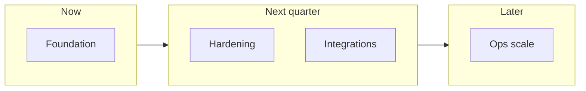

# Pending Roadmap and Backlog

This file is the canonical pending/backlog tracker at repository root.

# Remaining Work and Project Rating

This document is the **single source of truth** for roadmap, backlog, subjective maturity scores, and (optional) external workshop review notes.

**Engineering-only hardening bullets** also appear in [03 §8](docs/03-TECHNICAL-EXECUTION-BLUEPRINT.md); prioritize this file for **priorities and product scope**.

---

## 1. Remaining technical work (prioritized)

### P0 — Security and correctness

| Item | Description |
|------|-------------|
| **Input validation** | Zod (or equivalent) on every API route; consistent error shape |
| **RBAC** | Middleware per route from [05 matrix](docs/05-DOCUMENT-ALIGNMENT-AND-REFERENCE.md); verify every non-public route |
| **Secrets** | No defaults in prod; rotation policy for `JWT_SECRET` |
| **CORS** | Allowlist origins; environment-specific policy |

### P1 — Product completeness

| Item | Description |
|------|-------------|
| **Google Sign-In UX** | Complete parity across **web and mobile**; token handoff to `/api/auth/google/token` |
| **List scale** | Pagination or equivalent on **leave** and **ledger** lists if not already aligned with employees/tasks |
| **Mobile parity** | Settings, i18n behavior, and analytics/export flows aligned with web-admin where applicable |

*Shipped in recent iterations (no longer backlog here):* leave approval API + UI, pagination on core list APIs, date-bounded dashboard summary, CSV/PDF exports from the web app, EN/HI/MR toggle and settings (admin defaults + user overrides), attendance API and web-admin **Attendance** page, live API cutover via `VITE_USE_MOCK_API=false`. See **§2**.

### P2 — Operations and compliance

| Item | Description |
|------|-------------|
| **Export audit** | Audit logging for exports; server-side export jobs where compliance requires it |
| **Audit log (product)** | Finance and task edits beyond export-only auditing |
| **CI** | Lint, typecheck, build, tests on PR |
| **Monitoring** | Structured logs, dashboards, incident runbooks, alerts |

---

## 2. Recently delivered (snapshot)

Consolidated from prior rollout notes; use this as context, not a second backlog.

- `PATCH /api/leave/requests/:id/status` and manager/admin flows
- Live API path when `VITE_USE_MOCK_API=false`
- Pagination: `GET /api/employees`, `GET /api/tasks` (`page`, `limit`)
- Dashboard: `GET /api/dashboard/summary?fromDate=&toDate=&employeeId=`
- Web exports: CSV (dashboard, finance, analytics); PDF via print-to-PDF
- i18n toggle (EN/HI/MR), settings with org defaults and user overrides
- Attendance: `GET/POST /api/attendance`, `GET /api/attendance/me-profile`, web **Attendance** page, mock fixtures

---

## 3. Suggested product features (later)

- Push notifications for assignment changes.
- Attendance linked to **shifts** (schema supports attendance; deeper scheduling is future).
- Shortfall alerts when day target is at risk.

---

## 4. Product and UX backlog (planned tracks)

Implement **one track at a time**; keep **§1** security and correctness ahead of polish.

### A. Workshop practical fit (evaluation backlog)

- **Goal:** Score the product against **real daily workflows**: morning targets, shop-floor capture, escalation, end-of-day reconciliation, weekly planning, leave, advance/salary visibility, disputes.
- **Scope:** SK Enterprises (plastic molding, Pune) and a generic midsize Indian workshop (roughly 10–200 workers).
- **Deliverable:** Dimensions such as *Task clarity*, *Real-time visibility*, *Finance trust*, *Adoption friction*, *Mobile vs web parity* — scores **1–10** plus evidence (mock vs live vs missing).
- **Cadence:** Re-run after major milestones (e.g. post–live API, post–mobile parity). A **snapshot** from an external workshop review lives in **§7**.

### B. Internationalization (i18n)

- **Done (baseline):** Language toggle (EN/HI/MR), settings for org and user; web-admin first.
- **Remaining:** Full localization pass for **every** page string and status label; mobile aligned in a later pass.
- **Technical:** Central catalogs; avoid new hardcoded user-facing strings; locale-aware dates and numbers where it matters.

### C. Settings and preferences

- **Done (baseline):** Settings entry with role-aware sections; language and related prefs as above.
- **Later:** Notification toggles when push exists; default landing page; table page size; default export format; server-persisted preferences when auth records are authoritative.

### D. Dashboard and analytics

- **Done (baseline):** Date-bounded dashboard summary tied to assignments.
- **Later:** Deeper analytics (trends, throughput, shortfall risk, per-part/per-employee); charts with textual summaries for accessibility; caching/refresh strategy.

### E. Downloads: salary slip and exports

- **Done (baseline):** CSV exports and print-to-PDF flows on web for key areas.
- **Later:** Employee salary slip (PDF or print HTML), richer payroll/production datasets (optional XLSX), **export audit** and RBAC as in **§1 P2**.

### F. Pointer index

| Area | Pointer |
|------|--------|
| Security & ops | **§1 P0** — validation, RBAC, secrets, CORS |
| Core product gaps | **§1 P1** — Google Sign-In parity, list-scale gaps, mobile parity for settings/i18n/analytics/exports |
| Ops & observability | **§1 P2** — export audit, product audit log, CI, monitoring |
| Later features | **§3** — push, shift-level attendance, shortfall alerts |
| Platform | End-to-end **live API** adoption, **E2E tests**, performance budgets, production **canonical URL** and **OG** images, periodic **accessibility** pass |
| Compliance (optional) | Data retention, backup/restore runbooks |

---

## 5. Maturity ratings (subjective)

| Dimension | Score | Comment |
|-----------|-----:|---------|
| **Product clarity** | 9/10 | Domain is well bounded; docs explicit |
| **Architecture** | 8/10 | Monorepo + Prisma + REST; scale path exists |
| **Production hardening** | 6/10 | Validation, RBAC depth, CI, monitoring still in flight |
| **Documentation** | 9/10 | README + numbered docs + diagrams |
| **Test coverage** | 5/10 | Unit/E2E to expand |

**Overall:** Strong **foundation**; **pilot-ready** after P0 closure and staged rollout; production claim waits on **§1** and quality gates.

**External review (MIDC workshop, condensed):** overall **7.8 / 10** — demo-strong; production not recommended until P0/P1-style hardening is complete. Detail in **§7**.

---

## 6. Roadmap diagram

---

## 7. Appendix: MIDC workshop review snapshot

*Preserved from an external workshop review; not a second backlog.*

### Scorecard (1–10)

| Dimension | Score | Why |
|-----------|-----:|-----|
| Business fit for workshop operations | 8.5 | Core flows: assignments, progress, dashboard, leave, finance ledger |
| UX practicality (shop-floor + manager) | 8.0 | Role-based web/mobile; prototype mode for demo |
| Technical architecture | 8.5 | Monorepo, TypeScript, shared types, Prisma API |
| Security / readiness discipline | 7.0 | Patterns exist; hardening before production confidence |
| Scalability / maintainability | 8.0 | Modular APIs, docs, workspace scripts |
| Demo confidence (workshop) | 9.0 | `typecheck` and `build` pass; docs presentation-ready |
| Production readiness (then) | 6.5 | Pilot after P0/P1-style closure |

### Verdict

- **Workshop / demo:** Strong and credible for SME workshop digitization.
- **Pilot:** Achievable with a focused hardening sprint on validation, RBAC, and completeness gaps.
- **Production:** Not recommended until P0 controls and quality gates are tightened.

### 30-second pitch

SK Enterprises is a practical operations platform for Indian workshop realities: web-admin control, mobile floor updates, and a typed API for tasks, progress, leave, and finance. Architecture and docs are strong; the product is demo-ready. A focused hardening sprint on security, RBAC consistency, and pilot-completeness items can move it from showcase to live pilot confidently.

### Evaluator Q&A (top 5)

1. **Better than WhatsApp + Excel?** Structured, auditable workflows across tasking, progress, leave, and finance instead of fragmented channels and manual reconciliation.
2. **Practical for workers and managers?** Mobile captures employee updates; web-admin supports oversight, approvals, and visibility.
3. **Sustainable beyond a prototype?** Monorepo TypeScript, shared contracts, and Prisma support maintainability and staged rollout.
4. **Biggest risk before go-live?** Production hardening: validation/RBAC consistency, operational controls, automated quality gates.
5. **Next 4–6 weeks?** Hardening sprint, pilot with real users, operational metrics, then staged production rollout.

---

## 8. Related documents

- Onboarding: [README.md](README.md)
- Phases: [02-DEVELOPMENT-BLUEPRINT.md](docs/02-DEVELOPMENT-BLUEPRINT.md)
- Engineering backlog pointer: [03-TECHNICAL-EXECUTION-BLUEPRINT.md](docs/03-TECHNICAL-EXECUTION-BLUEPRINT.md) §8
- Decisions: [08-TECH-DECISIONS.md](docs/08-TECH-DECISIONS.md)
