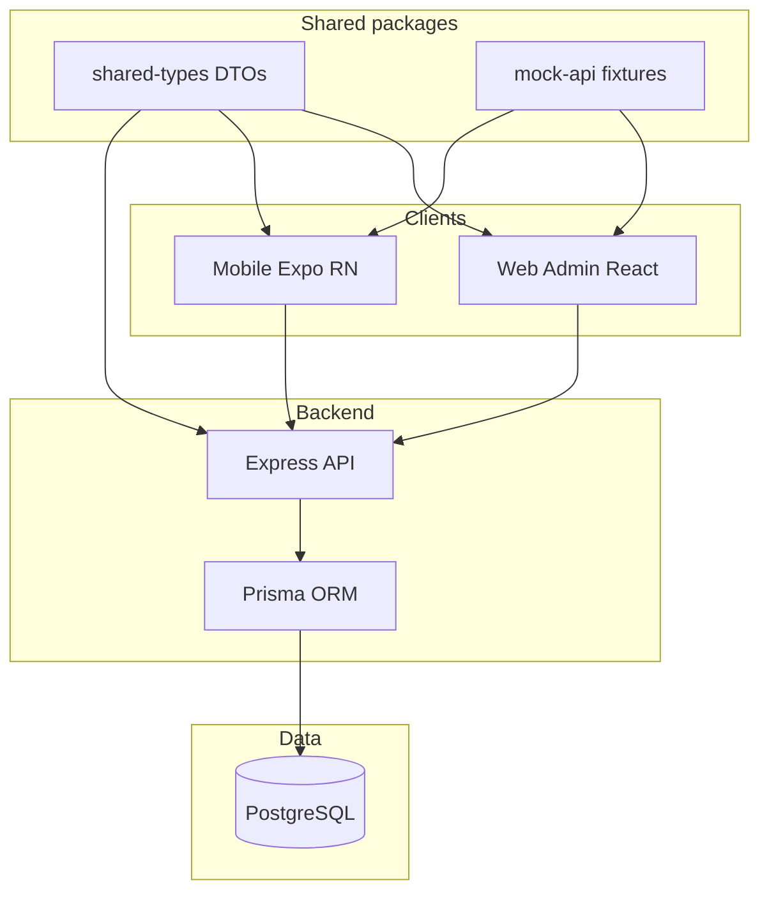
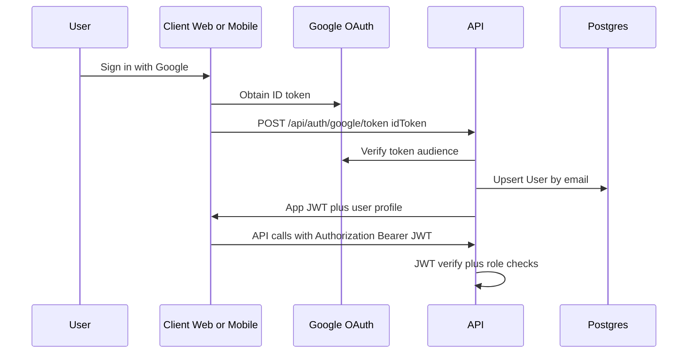

# SK Enterprises — Operations Platform (Monorepo)

**One platform. Two client apps. One API. Full workshop operations.**

SK Enterprises is a **plastic injection molding** workshop led by **Shubham Kale**, based in **Pune**. This repository is the digital backbone for **production tracking**, **people operations** (employees, leave), and **money operations** (salary, advances, credits, pending settlements)—with **admin/manager** tooling on the web and **employee** tooling on mobile.

This document is the **entry point** for business owners, tech reviewers, and developers. Deep dives live under [`docs/`](docs/00-INDEX.md).

---

## Table of contents

1. [Who this is for](#who-this-is-for)
2. [Problem and outcome](#problem-and-outcome)
3. [System context](#system-context)
4. [Prototype vs production modes](#prototype-vs-production-modes)
5. [Technology stack](#technology-stack)
6. [Repository layout](#repository-layout)
7. [Quick start (local)](#quick-start-local)
8. [IDE debugging (VS Code / Cursor)](#ide-debugging-vs-code--cursor)
9. [Environment variables](#environment-variables)
10. [API surface (summary)](#api-surface-summary)
11. [Security model (summary)](#security-model-summary)
12. [Deployment](#deployment)
13. [Quality gates](#quality-gates)
14. [Documentation index](#documentation-index)
15. [Glossary](#glossary)

---

## Who this is for

| Audience | What you read first |
|----------|---------------------|
| **Owner / operations** | [Business master doc](docs/01-BUSINESS-PLAN-AND-MASTER-DOCUMENT.md), [Product summary](docs/06-PRODUCT-AND-EXECUTION-SUMMARY.md), [User flows](docs/04-ARCHITECTURE-AND-USER-FLOWS.md) |
| **Tech reviewer / architect** | [Architecture & flows](docs/04-ARCHITECTURE-AND-USER-FLOWS.md), [Technical blueprint](docs/03-TECHNICAL-EXECUTION-BLUEPRINT.md), [Tech decisions](docs/08-TECH-DECISIONS.md), [API examples](docs/10-API-CONTRACT-EXAMPLES.md) |
| **Developer** | [Repo structure](docs/09-REPO-STRUCTURE.md), [Monorepo & deployment](docs/07-MONOREPO-AND-DEPLOYMENT.md), [Mock prototype](docs/12-MOCK-PROTOTYPE.md), this README |

---

## Problem and outcome

| Without a unified system | With this platform |
|--------------------------|--------------------|
| Tasks assigned verbally or on chat | **Structured assignments** with part number, part name, date, **target count** |
| No single view of “how much done today/week” | **Dashboard** and aggregates for **day vs week** achievement |
| Progress updates delayed until end of shift | **Incremental count updates** from mobile + **issue notes** |
| Leave and salary data in notebooks | **Leave requests** + **salary ledger** (advance, credit, deduction, pending) in one place |
| Hard to audit who changed what | Foundation for **audit trails** and stricter RBAC (see roadmap) |

---

## System context

### Logical architecture



### Authentication flow (target production)



---

## Prototype vs production modes

| Mode | When to use | Data source | Notes |
|------|-------------|-------------|--------|
| **Prototype (mock)** | UI/UX sprint, demos, no DB | `packages/mock-api` via env flags | Default-friendly: mock mode stays on unless explicitly disabled. See [docs/12-MOCK-PROTOTYPE.md](docs/12-MOCK-PROTOTYPE.md). |
| **Production (API + DB)** | Staging, pilot, go-live | PostgreSQL + `apps/api` | Run Prisma migrations, configure JWT and Google client IDs. |

**Web mock toggle:** `VITE_USE_MOCK_API` — mock unless set to `false`.  
**Mobile mock toggle:** `EXPO_PUBLIC_USE_MOCK_API` — mock unless set to `false`.

**Dev personas (web):** `VITE_DEV_ROLE=admin` or `employee` (employee narrows navigation for preview).  
**Dev roles (mobile):** `EXPO_PUBLIC_INITIAL_ROLE=ADMIN` or `EMPLOYEE`.

---

## Technology stack

| Layer | Choice | Rationale |
|-------|--------|-------------|
| **Web** | React 19, Vite, TypeScript, Redux Toolkit, Tailwind CSS | Fast iteration, strong typing, utility-first styling without custom CSS files |
| **Mobile** | React Native (Expo), TypeScript, Redux Toolkit | Single codebase for Android/iOS; OTA updates via Expo |
| **API** | Node.js, Express, TypeScript | Straightforward REST, easy to deploy on EC2 or Lambda later |
| **Data** | PostgreSQL + Prisma | Relational model fits employees, tasks, ledger, leave; migrations are first-class |
| **Auth** | Google ID token verification + app JWT | Central identity; short-lived JWT for API access |

---

## Repository layout

```text
sk-enterprises/
  apps/
    api/                 # Express + Prisma + PostgreSQL
    web-admin/           # Admin + employee-preview web UI
    mobile/              # Employee + admin tab shell (Expo)
  packages/
    mock-api/            # Shared prototype fixtures (mirrors API shapes)
    shared-types/        # Zod/TS contracts shared across apps
  docs/                  # Business + technical documentation
  .vscode/               # launch.json for Web/Mobile/API debug profiles
```

See [docs/09-REPO-STRUCTURE.md](docs/09-REPO-STRUCTURE.md) for file-level detail.

---

## Quick start (local)

1. **Install dependencies** (from repo root):

   ```bash
   npm install
   ```

2. **API environment** — copy example env and fill secrets:

   ```bash
   cp apps/api/.env.example apps/api/.env
   ```

3. **PostgreSQL** (Docker):

   ```bash
   docker compose up -d postgres
   ```

4. **Prisma** (API workspace):

   ```bash
   npm run prisma:generate --workspace api
   npm run prisma:migrate --workspace api
   ```

5. **Run apps** (separate terminals or use [compound launches](#ide-debugging-vs-code--cursor)):

   ```bash
   npm run dev:api
   npm run dev:web
   npm run dev:mobile
   ```

- **Web:** typically `http://localhost:5173` (Vite).  
- **API:** default `http://localhost:4000` — `GET /health` for smoke.  
- **Mobile:** Expo dev server; scan QR in Expo Go or run emulator.

---

## IDE debugging (VS Code / Cursor)

Launch profiles live in [`.vscode/launch.json`](.vscode/launch.json). Examples:

| Configuration | Purpose |
|---------------|---------|
| **Web: Admin (Vite)** | Full admin navigation; `VITE_DEV_ROLE=admin` |
| **Web: Employee (Vite)** | Employee nav preview; `VITE_DEV_ROLE=employee` |
| **Mobile: Admin / Employee (Expo)** | Sets `EXPO_PUBLIC_INITIAL_ROLE` and opens the right tab |
| **API (Express)** | Backend only |
| **API + Web** (compound) | API + web together |

Details: [`.vscode/README.md`](.vscode/README.md).

**Cursor:** rules, commands, agents, and PR checklist for this repo live in [`.cursor/README.md`](.cursor/README.md).

---

## Environment variables

### API (`apps/api/.env`)

| Variable | Purpose |
|----------|---------|
| `DATABASE_URL` | PostgreSQL connection string |
| `PORT` | HTTP port (default 4000) |
| `JWT_SECRET` | Signing app JWTs |
| `GOOGLE_CLIENT_ID` | Google OAuth client (token verification) |
| `GOOGLE_CLIENT_SECRET` | If using server-side OAuth (future) |
| `GOOGLE_CALLBACK_URL` | Callback URL if using redirect flow (future) |
| `NOTIFICATION_PROVIDER` | `none` or `custom` provider mode for notifications |
| `EMAIL_NOTIFICATIONS_ENABLED` | Enable/disable email notification dispatch path |
| `SMS_NOTIFICATIONS_ENABLED` | Enable/disable SMS notification dispatch path |
| `WORKSHOP_NAME` | Workshop display name used by location endpoint |
| `WORKSHOP_LATITUDE` | Workshop latitude for map URL generation |
| `WORKSHOP_LONGITUDE` | Workshop longitude for map URL generation |
| `CORS_ORIGINS` | Comma-separated allowed browser origins (required for web-admin and public lead capture from another host, e.g. `http://localhost:5173`) |
| `TRUST_PROXY` | `true` when the API sits behind Nginx/ALB so rate limits use the client IP |
| `PUBLIC_LEAD_NOTIFY_EMAIL` | Comma-separated inboxes for new public lead notifications (with `EMAIL_NOTIFICATIONS_ENABLED` and `NOTIFICATION_PROVIDER`) |
| `PUBLIC_LEAD_RATE_MAX` | Max public lead submissions per IP per window (default 5) |
| `PUBLIC_LEAD_RATE_WINDOW_MS` | Rate-limit window in ms (default 15 minutes) |

### Web (`apps/web-admin` — see `.env.example`)

| Variable | Purpose |
|----------|---------|
| `VITE_USE_MOCK_API` | `true`/`false` — mock vs live API |
| `VITE_API_BASE_URL` | API base when mock is off; also used to post public contact leads when set |
| `VITE_PUBLIC_LEAD_CAPTURE` | Set to `false` to keep contact form mailto-only (e.g. static hosting without API) |
| `VITE_GA_MEASUREMENT_ID` | Optional GA4 ID (`G-…`) — loads gtag only when set |
| `VITE_GOOGLE_SITE_VERIFICATION` | Optional Search Console HTML tag `content` value |
| `VITE_DEV_ROLE` | `admin` or `employee` for UI preview |
| `VITE_WORKSHOP_MAP_*` | Optional map URLs/coordinates for location page |

### Mobile (`apps/mobile` — see `.env.example`)

| Variable | Purpose |
|----------|---------|
| `EXPO_PUBLIC_USE_MOCK_API` | Mock vs live |
| `EXPO_PUBLIC_INITIAL_ROLE` | `ADMIN` or `EMPLOYEE` for first-run UX |
| `EXPO_PUBLIC_WORKSHOP_MAP_*` | Optional map URL/coordinates for location tab |

Never commit real `.env` files. Use `.env.example` only as a template.

---

## API surface (summary)

| Area | Prefix | Notes |
|------|--------|--------|
| Health | `GET /health` | Liveness |
| Public marketing | `POST /api/public/leads` | Contact / RFQ form (no auth; persisted in `PublicLead`; rate-limited) |
| Marketing (staff) | `GET /api/marketing/leads` | List public leads (`ADMIN` / `MANAGER`) |
| Auth | `/api/auth/*` | Google token exchange, JWT |
| Employees | `/api/employees` | CRUD-style list/create |
| Tasks | `/api/tasks/*` | Assign, progress, suggestions |
| Dashboard | `/api/dashboard/*` | Day/week aggregates |
| Finance | `/api/finance/*` | Salary ledger per employee |
| Leave | `/api/leave/*` | Requests and history |
| Notifications | `/api/notifications/*` | Workshop location, manual dispatch, daily-summary; task assign / leave status / ledger also queue notifications |

Full JSON examples: [docs/10-API-CONTRACT-EXAMPLES.md](docs/10-API-CONTRACT-EXAMPLES.md).

---

## Security model (summary)

- **Input validation** at API boundaries (roadmap: Zod on every route).
- **No secrets** in source; use environment variables.
- **JWT** for authenticated sessions; **Google ID token** verified server-side before issuing JWT.
- **Role-based access** (`ADMIN`, `MANAGER`, `EMPLOYEE`) — enforced in middleware; matrix in [docs/05-DOCUMENT-ALIGNMENT-AND-REFERENCE.md](docs/05-DOCUMENT-ALIGNMENT-AND-REFERENCE.md).

---

## Deployment

- **Local / private server:** Docker Compose for Postgres; Node for API; static or Vite host for web; Expo for mobile.
- **AWS (EC2):** Nginx reverse proxy + TLS; API as process or container; RDS or managed Postgres; see [docs/11-AWS-INFRASTRUCTURE-COSTS.md](docs/11-AWS-INFRASTRUCTURE-COSTS.md).

Detailed runbooks: [docs/07-MONOREPO-AND-DEPLOYMENT.md](docs/07-MONOREPO-AND-DEPLOYMENT.md).

---

## Quality gates

From repo root:

```bash
npm run typecheck
npm run build
```

API and Prisma: `npm run prisma:generate --workspace api` after schema changes.

---

## Documentation index

| Doc | Contents |
|-----|----------|
| [00-INDEX.md](docs/00-INDEX.md) | Master index |
| [01](docs/01-BUSINESS-PLAN-AND-MASTER-DOCUMENT.md) | Business context, objectives, stakeholders |
| [02](docs/02-DEVELOPMENT-BLUEPRINT.md) | Phased delivery plan |
| [03](docs/03-TECHNICAL-EXECUTION-BLUEPRINT.md) | Stack, endpoints, hardening |
| [04](docs/04-ARCHITECTURE-AND-USER-FLOWS.md) | Architecture, journeys, diagrams |
| [05](docs/05-DOCUMENT-ALIGNMENT-AND-REFERENCE.md) | Glossary, RBAC matrix, doc dependencies |
| [06](docs/06-PRODUCT-AND-EXECUTION-SUMMARY.md) | Executive product summary |
| [07](docs/07-MONOREPO-AND-DEPLOYMENT.md) | Monorepo, env, deployment, operations |
| [PENDING](PENDING.md) | Roadmap, backlog, ratings, optional workshop appendix |
| [08](docs/08-TECH-DECISIONS.md) | ADRs and alternatives |
| [09](docs/09-REPO-STRUCTURE.md) | Repository tree |
| [10](docs/10-API-CONTRACT-EXAMPLES.md) | JSON request/response examples |
| [11](docs/11-AWS-INFRASTRUCTURE-COSTS.md) | AWS cost bands |
| [12](docs/12-MOCK-PROTOTYPE.md) | Mock prototype workflow |
| [13](docs/13-MICROSOFT-INSPIRED-UX-STANDARDS.md) | Microsoft-inspired UI/UX standards |

---

## Glossary

| Term | Meaning |
|------|---------|
| **Task assignment** | A dated piece of work for an employee with **target count** (e.g. press 1000 units) tied to **part number + part name**. |
| **Progress log** | Incremental update (e.g. +50) with optional **issue note**; feeds into `achievedCount`. |
| **Task suggestion** | Manager comment on an assignment (process improvement). |
| **Ledger entry** | Financial row: salary credit, advance, deduction, adjustment. |
| **Leave request** | Dated range with status (pending/approved/rejected). |

---

## Summary

This monorepo delivers a **production-grade foundation** for SK Enterprises: **role-based** web and mobile clients, a **typed REST API**, a **normalized PostgreSQL schema** via Prisma, a **mock-first prototype path**, and documentation suitable for **internal rollout** and **external technical review**.

For next steps: see [PENDING.md](PENDING.md).
