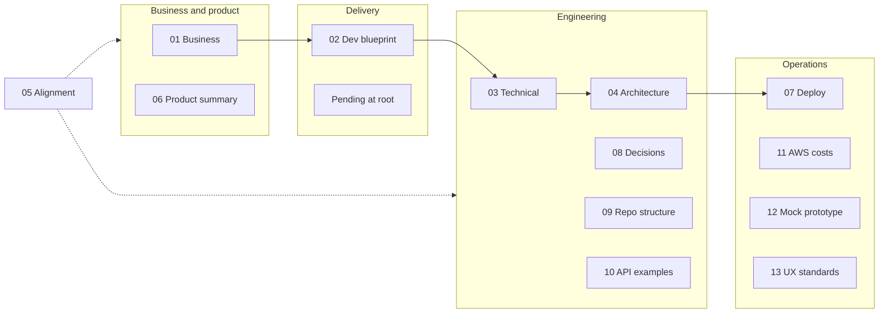

# SK Enterprises — Documentation Index

This folder contains the **authoritative** business, product, and technical narrative for the SK Enterprises operations platform. Documents are numbered for reading order; cross-links keep business intent aligned with implementation.

## How to read

---

## Document list

| # | File | Description |
|---|------|---------------|
| 01 | [01-BUSINESS-PLAN-AND-MASTER-DOCUMENT.md](./01-BUSINESS-PLAN-AND-MASTER-DOCUMENT.md) | Workshop context, objectives, stakeholders, risks, success metrics |
| 02 | [02-DEVELOPMENT-BLUEPRINT.md](./02-DEVELOPMENT-BLUEPRINT.md) | Phased delivery, milestones, scope per phase |
| 03 | [03-TECHNICAL-EXECUTION-BLUEPRINT.md](./03-TECHNICAL-EXECUTION-BLUEPRINT.md) | Stack, API modules, middleware, validation roadmap |
| 04 | [04-ARCHITECTURE-AND-USER-FLOWS.md](./04-ARCHITECTURE-AND-USER-FLOWS.md) | System architecture, journeys, sequence diagrams |
| 05 | [05-DOCUMENT-ALIGNMENT-AND-REFERENCE.md](./05-DOCUMENT-ALIGNMENT-AND-REFERENCE.md) | Glossary, RBAC matrix, doc dependency rules |
| 06 | [06-PRODUCT-AND-EXECUTION-SUMMARY.md](./06-PRODUCT-AND-EXECUTION-SUMMARY.md) | Executive one-pager: scope, value, status |
| 07 | [07-MONOREPO-AND-DEPLOYMENT.md](./07-MONOREPO-AND-DEPLOYMENT.md) | Workspace layout, env, local and cloud deployment |
| 08 | [08-TECH-DECISIONS.md](./08-TECH-DECISIONS.md) | Architecture Decision Records (ADR-style) |
| 09 | [09-REPO-STRUCTURE.md](./09-REPO-STRUCTURE.md) | Directory tree, Prisma entities |
| 10 | [10-API-CONTRACT-EXAMPLES.md](./10-API-CONTRACT-EXAMPLES.md) | JSON request/response examples |
| 11 | [11-AWS-INFRASTRUCTURE-COSTS.md](./11-AWS-INFRASTRUCTURE-COSTS.md) | AWS monthly cost scenarios |
| 12 | [12-MOCK-PROTOTYPE.md](./12-MOCK-PROTOTYPE.md) | Mock data workflow and cutover to live API |
| 13 | [13-MICROSOFT-INSPIRED-UX-STANDARDS.md](./13-MICROSOFT-INSPIRED-UX-STANDARDS.md) | UI/UX standards for Microsoft-inspired enterprise look and feel |

---

## Root README

The repository [README.md](../README.md) is the **primary onboarding** document for developers and reviewers linking into this folder.
