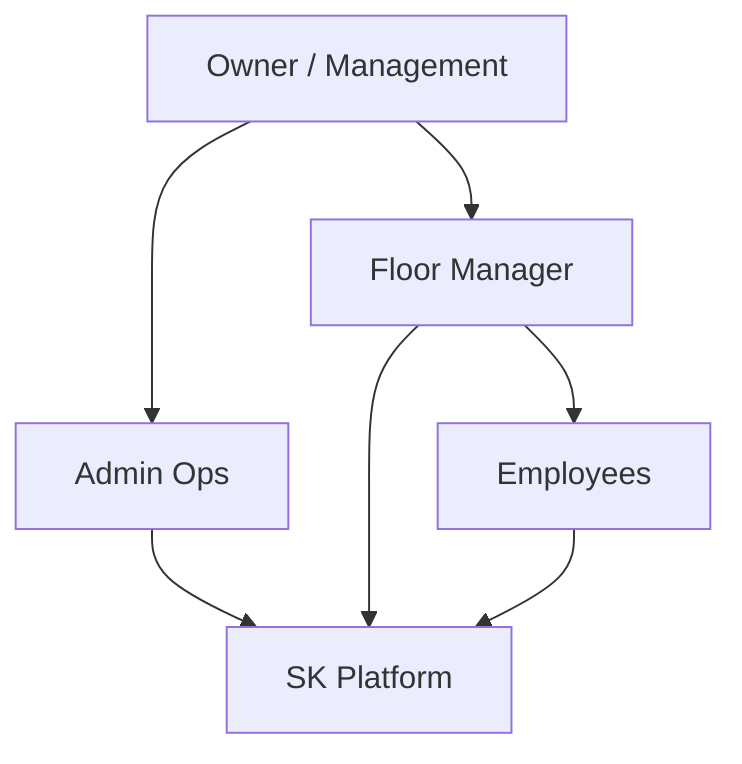

# Business Plan and Master Document

## 1. Organization context

**SK Enterprises** is a **plastic injection molding** workshop operating in **Pune**, led by **Shubham Kale**, focused on **molded components** and batch production. Operations are **labour-intensive** and **batch-oriented**: work is assigned by part, target quantity, and calendar day or week; progress must be visible in near real time to avoid late discovery of machine issues, material shortages, or quality drift.

---

## 2. Business problem

| Pain | Impact |
|------|--------|
| **Informal task assignment** (verbal, WhatsApp) | Targets are unclear; end-of-day reconciliation is painful |
| **No single “achieved vs target” view** | Planning next shift is guesswork |
| **Delayed issue reporting** | Machine downtime and rework costs go up |
| **Fragmented HR/finance data** | Leave balances, advances, and pending payments are hard to audit |
| **Limited audit trail** | Disputes on counts or payouts are harder to resolve |

---

## 3. Product vision

Deliver a **single digital operations layer** for:

1. **Production** — assign work to employees with **part identity** (part number + part name) and **target** counts; capture **incremental progress** and **issues** during the shift.
2. **Visibility** — **dashboards** for day and week performance (achieved vs target).
3. **People** — **employees** on record; **leave** requests and history.
4. **Money** — **salary ledger** (advance, credit, deduction, pending) in one place.

**Channels:**

- **Web (admin/manager)** — planning, oversight, finance, leave.
- **Mobile (employee)** — shop-floor updates, leave requests, salary snapshot.

---

## 4. Stakeholder map

| Stakeholder | Interest |
|-------------|----------|
| **Owner / management** | Revenue, throughput, cost control, compliance |
| **Admin / back office** | Master data, payroll-related inputs, leave policy |
| **Floor manager** | Daily targets, issues, reallocating work |
| **Employees** | Clear tasks, fair recording of work, leave |

---

## 5. Primary objectives (measurable)

| Objective | KPI | Notes |
|-----------|-----|--------|
| **Task clarity** | 100% of active assignments have part + target + date | Reduces ambiguity |
| **Timeliness of updates** | Majority of progress updates same shift | Mobile-first |
| **Visibility** | Dashboard shows day/week aggregate | Management review |
| **Financial traceability** | Ledger entries for advance/credit | Audit-friendly |

---

## 6. Scope boundaries (MVP vs later)

**In scope (MVP foundation):**

- User roles: admin, manager, employee.
- Task assignment, progress, suggestions, dashboard aggregates.
- Leave requests and ledger entries.
- Google-based auth + JWT (technical path).

**Out of scope (initial phases):**

- Full payroll processing engine (tax rules, statutory forms).
- IoT integration with machines.
- Advanced BI beyond exports.

---

## 7. Risks and mitigations

| Risk | Mitigation |
|------|------------|
| **Adoption resistance** | Mobile UX must be simple; manager training |
| **Data entry errors** | Validation, confirmations, audit logs (roadmap) |
| **Connectivity** | Offline queue for mobile (future); mock-first dev for UI |
| **Security** | No secrets in repo; JWT + RBAC; HTTPS in production |

---

## 8. Success criteria

- Managers can **assign** and **see progress** without manual spreadsheets.
- Employees can **update counts** and **flag issues** without leaving the floor.
- Leadership can answer **“how much did we achieve today vs plan?”** from the dashboard.
- Finance can **trace advances and credits** against employees.

---

## 9. Related documents

- Delivery plan: [02-DEVELOPMENT-BLUEPRINT.md](./02-DEVELOPMENT-BLUEPRINT.md)
- Product summary: [06-PRODUCT-AND-EXECUTION-SUMMARY.md](./06-PRODUCT-AND-EXECUTION-SUMMARY.md)
- User flows: [04-ARCHITECTURE-AND-USER-FLOWS.md](./04-ARCHITECTURE-AND-USER-FLOWS.md)
