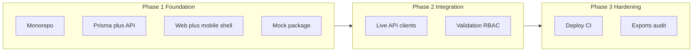
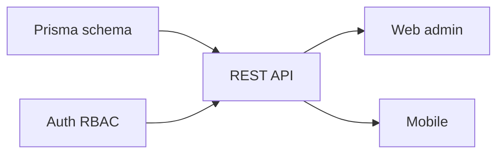

# Development Blueprint

This document defines **phased delivery** for the SK Enterprises platform: what ships when, in what order, and what dependencies exist between phases.

---

## Phase overview

*(Timeline is indicative; calendar dates depend on team capacity.)*

---

## Phase 1 — Foundation (current baseline)

**Goal:** End-to-end skeleton in **one monorepo** so all work shares types and conventions.

| Workstream | Deliverable |
|------------|-------------|
| **Repository** | `apps/api`, `apps/web-admin`, `apps/mobile`, `packages/shared-types`, `packages/mock-api` |
| **Data** | Prisma schema for users, employees, tasks, progress, suggestions, leave, ledger, attendance |
| **API** | Express modules: auth, employees, tasks, dashboard, finance, leave |
| **Web** | Redux + Tailwind; pages: dashboard, employees, tasks, finance, leave; dark/light theme |
| **Mobile** | Expo app; role switch; employee-first flows |
| **Prototype** | Mock fixtures so UI can ship without DB |
| **Docs** | Business + technical docs; API examples |

**Exit criteria:** `npm run typecheck` and `npm run build` green; local run documented; mock path documented.

---

## Phase 2 — Product integration and UX polish

**Goal:** Treat **mobile + web** as production UX; wire **real API** where needed.

| Workstream | Deliverable |
|------------|-------------|
| **API client** | Typed fetch/RTK Query in web + mobile; error handling |
| **Validation** | Zod (or equivalent) on every API mutation |
| **RBAC** | Middleware per route from role matrix |
| **Pagination** | List endpoints for employees, tasks, leave, ledger |
| **Mobile** | Offline-tolerant queue for progress updates (retry) |
| **Testing** | Vitest/Jest for API routes; critical path E2E |

**Exit criteria:** Primary flows work against Postgres in staging; no mock required for demo.

---

## Phase 3 — Hardening and scale

**Goal:** **Production** deployment on EC2 or Lambda + RDS; **observability** and **exports**.

| Workstream | Deliverable |
|------------|-------------|
| **Auth** | Google Sign-In UX on web/mobile; refresh strategy if needed |
| **Deploy** | CI/CD pipeline; secrets management; TLS |
| **Exports** | CSV for payroll and weekly production |
| **Notifications** | In-app first; optional SMS/email later |
| **Audit** | Audit log for finance and task edits |

**Exit criteria:** Runbook for incident response; backup/restore tested; cost guardrails.

---

## Dependency graph (technical)

---

## Related documents

- Technical detail: [03-TECHNICAL-EXECUTION-BLUEPRINT.md](./03-TECHNICAL-EXECUTION-BLUEPRINT.md)
- Roadmap and backlog: [PENDING.md](../PENDING.md)
