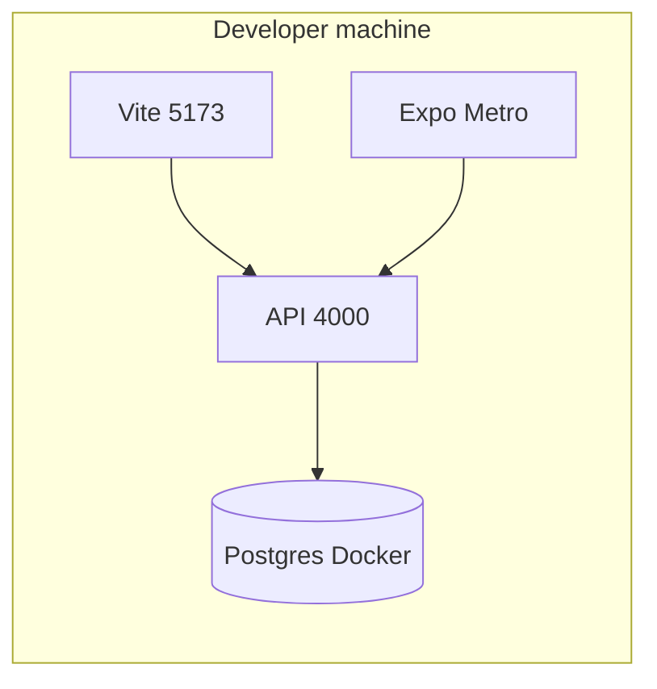
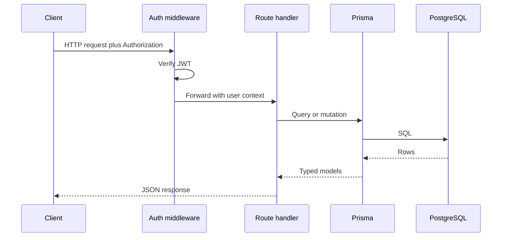

# Technical Execution Blueprint

This document is the **engineering companion** to the business plan: concrete stack choices, API layout, request lifecycle, and the hardening backlog.

---

## 1. Stack reference

| Layer | Technology | Version policy |
|-------|------------|----------------|
| Language | TypeScript | Strict mode; shared across apps |
| Web | React + Vite + Redux Toolkit + Tailwind | No custom CSS files; utilities only |
| Mobile | React Native (Expo) + Redux Toolkit | EAS when shipping stores |
| API | Express (Node) | ESM where configured |
| ORM | Prisma | Migrations are source of truth |
| Database | PostgreSQL | Money as `Decimal`; timestamps UTC |

---

## 2. Runtime topology (development)

---

## 3. API base and health

| URL | Purpose |
|-----|---------|
| `http://localhost:4000` | Default API base (override with `PORT`) |
| `GET /health` | Liveness probe `{ ok: true }` |

---

## 4. Request lifecycle (conceptual)

**Roadmap:** insert **validation** (Zod) immediately after auth and before DB for mutations.

---

## 5. Auth endpoints

| Method | Path | Purpose |
|--------|------|---------|
| `POST` | `/api/auth/google/token` | Verify Google **ID token**, upsert user, return **app JWT** |
| `GET` | `/api/auth/google/start` | Scaffold / documentation hint |

**Body (token exchange):** `{ "idToken": string, "role"?: "ADMIN" | "MANAGER" | "EMPLOYEE" }`

**Response:** `{ token: string, user: User }`

---

## 6. Domain endpoints (summary)

### Employees

| Method | Path | Purpose |
|--------|------|---------|
| `GET` | `/api/employees` | List employees (with profiles) |
| `POST` | `/api/employees` | Create employee + profile |

### Tasks

| Method | Path | Purpose |
|--------|------|---------|
| `GET` | `/api/tasks` | List assignments; optional `?employeeId=` |
| `POST` | `/api/tasks/assign` | Create template + assignment |
| `POST` | `/api/tasks/:id/progress` | Append progress log; bump achieved count |
| `POST` | `/api/tasks/:id/suggestions` | Manager suggestion record |

### Dashboard

| Method | Path | Purpose |
|--------|------|---------|
| `GET` | `/api/dashboard/summary` | Day/week achieved vs target aggregates |

### Finance

| Method | Path | Purpose |
|--------|------|---------|
| `GET` | `/api/finance/ledger/:employeeId` | Ledger lines for employee |
| `POST` | `/api/finance/ledger` | New ledger entry |

### Leave

| Method | Path | Purpose |
|--------|------|---------|
| `GET` | `/api/leave/requests/:employeeId` | Leave history |
| `POST` | `/api/leave/requests` | Create leave request |
| `PATCH` | `/api/leave/requests/:id/status` | Approve or reject leave (ADMIN/MANAGER) |

### Attendance

| Method | Path | Purpose |
|--------|------|---------|
| `GET` | `/api/attendance/me-profile` | Current user’s `employeeProfileId` (or `null`) |
| `GET` | `/api/attendance` | List `fromDate`, `toDate`, optional `employeeProfileId`, `page`, `limit` (EMPLOYEE: own rows only) |
| `POST` | `/api/attendance` | Upsert presence for `(employeeProfileId, attendanceDate)` — `EMPLOYEE` may only self |

### Notifications (SMS/email scaffold)

| Method | Path | Purpose |
|--------|------|---------|
| `GET` | `/api/notifications/workshop-location` | Workshop name + coordinates + Google Maps URL |
| `POST` | `/api/notifications/dispatch` | Manual notification dispatch (ADMIN/MANAGER) |
| `POST` | `/api/notifications/daily-summary` | Build day summary from task data; notify ADMIN/MANAGER |

Domain flows also **queue** notification payloads (same event types) when tasks are assigned, leave status changes, or ledger entries are created. Delivery depends on `NOTIFICATION_PROVIDER` and email/SMS env flags.

Full JSON shapes: [10-API-CONTRACT-EXAMPLES.md](./10-API-CONTRACT-EXAMPLES.md).

---

## 7. Error handling (target standard)

| HTTP | Meaning | Client behaviour |
|------|---------|------------------|
| `400` | Validation error | Show field errors |
| `401` | Missing/invalid auth | Redirect to login |
| `403` | Forbidden (role) | Show access denied |
| `404` | Resource missing | Not found UI |
| `500` | Server error | Generic message; log server-side |

**Rule:** Never return stack traces to clients.

---

## 8. Hardening backlog (engineering)

**Prioritized backlog, shipped snapshot, and product scope:** [PENDING.md](../PENDING.md) (includes validation, RBAC, list scale, CI, monitoring).

**Engineering complements** (not duplicated in full in **08**):

1. **Rate limiting** — public auth endpoints.
2. **Structured logging** — correlation ID; no PII in logs.
3. **Indexes** — Prisma schema indexes on `employeeId`, `assignmentDate`, `status` as query patterns stabilize.

---

## 9. Related documents

- Roadmap and backlog: [PENDING.md](../PENDING.md)
- Architecture: [04-ARCHITECTURE-AND-USER-FLOWS.md](./04-ARCHITECTURE-AND-USER-FLOWS.md)
- Decisions: [08-TECH-DECISIONS.md](./08-TECH-DECISIONS.md)
- API examples: [10-API-CONTRACT-EXAMPLES.md](./10-API-CONTRACT-EXAMPLES.md)
