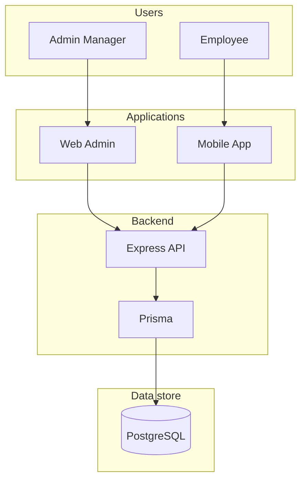
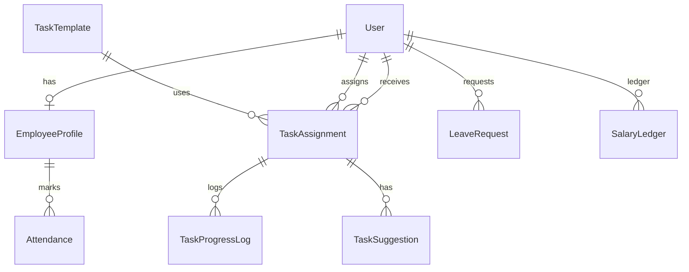
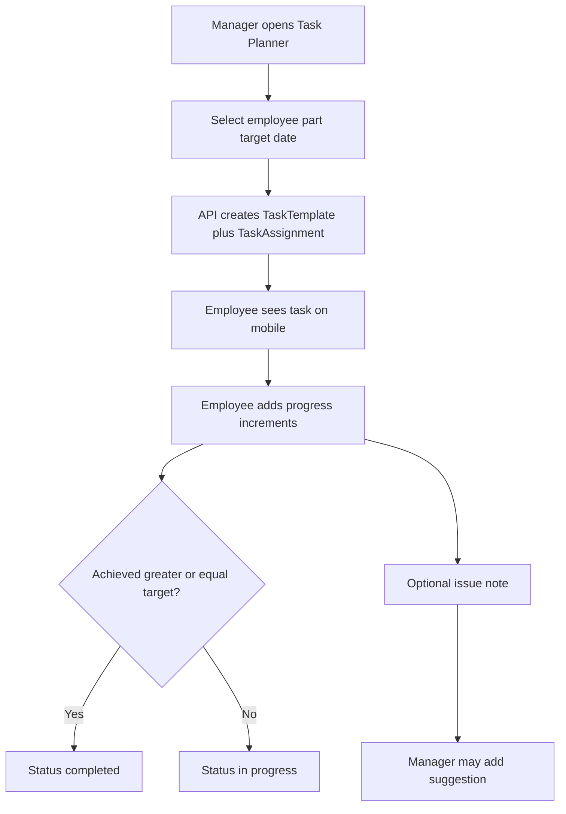
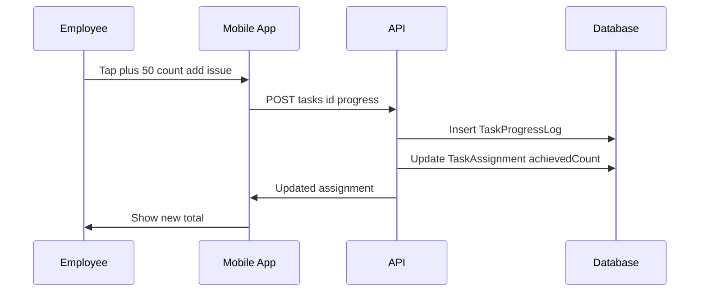
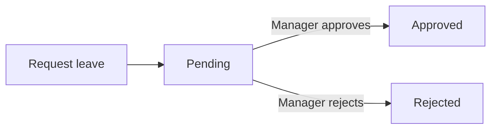
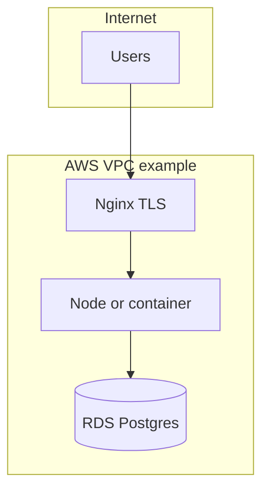

# Architecture and User Flows

This document describes **how the system is structured** and **how people move through it** during real operations.

---

## 1. Container view (C4-style)

---

## 2. Domain model (conceptual ER)

Core persistence aligns with Prisma models in `apps/api/prisma/schema.prisma`.

**Note:** `TaskTemplate` holds reusable **part number + part name**; each **assignment** binds a template to an employee and date with a **target count**.

---

## 3. User journey — assign and complete a task

---

## 4. Sequence — progress update (shop floor)

---

## 5. User journey — leave

---

## 6. User journey — finance snapshot

1. **Admin** posts ledger entries (advance, salary credit, adjustment).
2. **Employee** sees **advance taken** and **pending** on mobile (aggregates derived from ledger in product iterations).

---

## 7. Deployment architecture (typical EC2)

NAT Gateway and ALB are optional cost drivers; see [11-AWS-INFRASTRUCTURE-COSTS.md](./11-AWS-INFRASTRUCTURE-COSTS.md).

---

## 8. Related documents

- Technical blueprint: [03-TECHNICAL-EXECUTION-BLUEPRINT.md](./03-TECHNICAL-EXECUTION-BLUEPRINT.md)
- Deployment: [07-MONOREPO-AND-DEPLOYMENT.md](./07-MONOREPO-AND-DEPLOYMENT.md)
