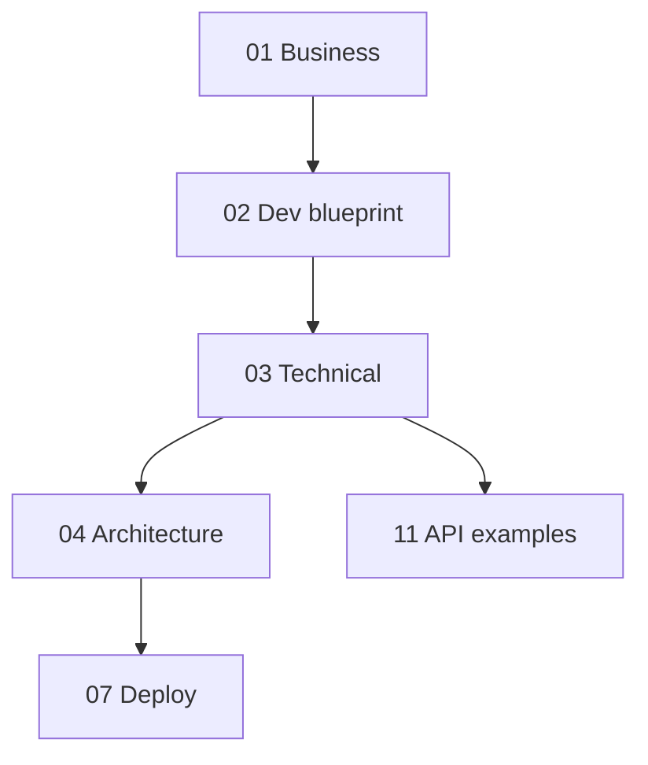

# Document Alignment and Reference

This document keeps **terminology**, **permissions**, and **documentation dependencies** explicit so business and engineering stay aligned.

---

## 1. Glossary

| Term | Definition |
|------|------------|
| **User** | Login identity (email, Google id); has `UserRole`. |
| **Employee profile** | Salary base, leave allowance, phone; 1:1 with user when user is an employee. |
| **Task template** | Part number + part name (+ optional default notes). |
| **Task assignment** | Template + employee + date + target + achieved + status + notes. |
| **Progress log** | Append-only increment with optional issue text. |
| **Suggestion** | Manager comment on an assignment. |
| **Ledger entry** | Financial line: type + amount + note + employee. |
| **Leave request** | Date range + days + status. |
| **Attendance** | One presence row per employee profile per calendar day (`isPresent`, optional `notes`). |

---

## 2. Document dependency map

**Rule:** When the **Prisma schema** changes, update **03**, **04**, **10**, and **11** as needed. When **routes** change, update **03** and **11**.

---

## 3. Role and permission matrix

| Action | ADMIN | MANAGER | EMPLOYEE |
|--------|:-----:|:-------:|:--------:|
| Sign in (Google + JWT) | Yes | Yes | Yes |
| Add / manage employees | Yes | Yes | No |
| Assign tasks | Yes | Yes | No |
| Update task progress (shop floor) | Optional | Optional | Yes |
| Add issue note on task | Yes | Yes | Yes |
| Add manager suggestion | Yes | Yes | No |
| View org dashboard | Yes | Yes | Limited |
| Add finance ledger entry | Yes | Yes | No |
| View own salary / advance snapshot | Yes | Yes | Yes (own) |
| Submit leave request | Yes | Yes | Yes |
| Approve / reject leave | Yes | Yes | No |
| View all employees’ leave | Yes | Yes | No |
| List attendance (date range); filter by employee | Yes | Yes | Own records only |
| Record or update attendance for any employee | Yes | Yes | Self only |

**Implementation note:** Enforce with **JWT claims** + **per-route checks**; do not rely on UI hiding alone.

---

## 4. Alignment checklist (PR review)

- [ ] API change reflected in `docs/11` if contract changes.
- [ ] Schema change reflected in `docs/04` / `docs/10`.
- [ ] New env vars documented in `README` and `docs/07`.
- [ ] RBAC matrix updated if permissions change.

---

## 5. Related documents

- Business: [01-BUSINESS-PLAN-AND-MASTER-DOCUMENT.md](./01-BUSINESS-PLAN-AND-MASTER-DOCUMENT.md)
- Decisions: [08-TECH-DECISIONS.md](./08-TECH-DECISIONS.md)
