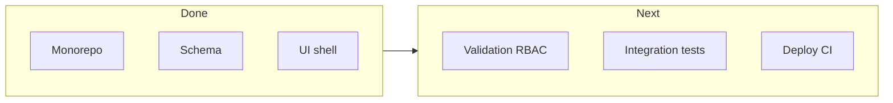

# Product and Execution Summary

**One-page executive view** of what SK Enterprises software is, who it serves, what is delivered today, and what “done” looks like for a pilot rollout.

---

## 1. Product in one paragraph

SK Enterprises software is a **workshop operations platform** for **plastic molding** manufacturing in **Pune**. It lets **managers** plan and monitor **production** by **employee**, **part**, and **target**; lets **employees** record **progress** and **issues** from **mobile**; and centralizes **leave** and **salary ledger** information so finance and HR are not scattered across notebooks and chats.

---

## 2. Who uses what

| Persona | Primary device | Core jobs |
|---------|----------------|-----------|
| **Admin / manager** | Web | Employees, task assignment, dashboard, finance, leave oversight |
| **Employee** | Mobile | Today’s tasks, count updates, issues, leave request, salary snapshot |
| **Owner** | Web (dashboard) | Day/week throughput vs plan |

---

## 3. Value delivered

| Value theme | How the product delivers |
|-------------|---------------------------|
| **Throughput** | Clear targets; fewer “how much left?” conversations |
| **Quality / uptime** | Issues logged early with task context |
| **Trust** | Ledger and leave in one system (audit path) |
| **Scalability** | Monorepo + API + Postgres; can grow to more lines/shifts |

---

## 4. Current state (foundation)

| Area | Status |
|------|--------|
| Monorepo | Delivered |
| Prisma schema + API modules | Delivered (hardening ongoing) |
| Web admin + theme | Delivered |
| Mobile shell + roles | Delivered |
| Mock prototype path | Delivered (`@sk/mock-api`) |
| Production auth UX | Roadmap |
| Full RBAC + validation | Roadmap |

---

## 5. Execution snapshot

---

## 6. “Pilot ready” definition

- Employees use **mobile** for real shifts for **2+ weeks**.
- Managers use **web** for assignments and review **daily**.
- **Dashboard** numbers match floor expectations within agreed tolerance.
- **No critical** security or data-loss issues; **backup** tested.

---

## 7. Related documents

- Business: [01-BUSINESS-PLAN-AND-MASTER-DOCUMENT.md](./01-BUSINESS-PLAN-AND-MASTER-DOCUMENT.md)
- Phases: [02-DEVELOPMENT-BLUEPRINT.md](./02-DEVELOPMENT-BLUEPRINT.md)
- Roadmap: [PENDING.md](../PENDING.md)
