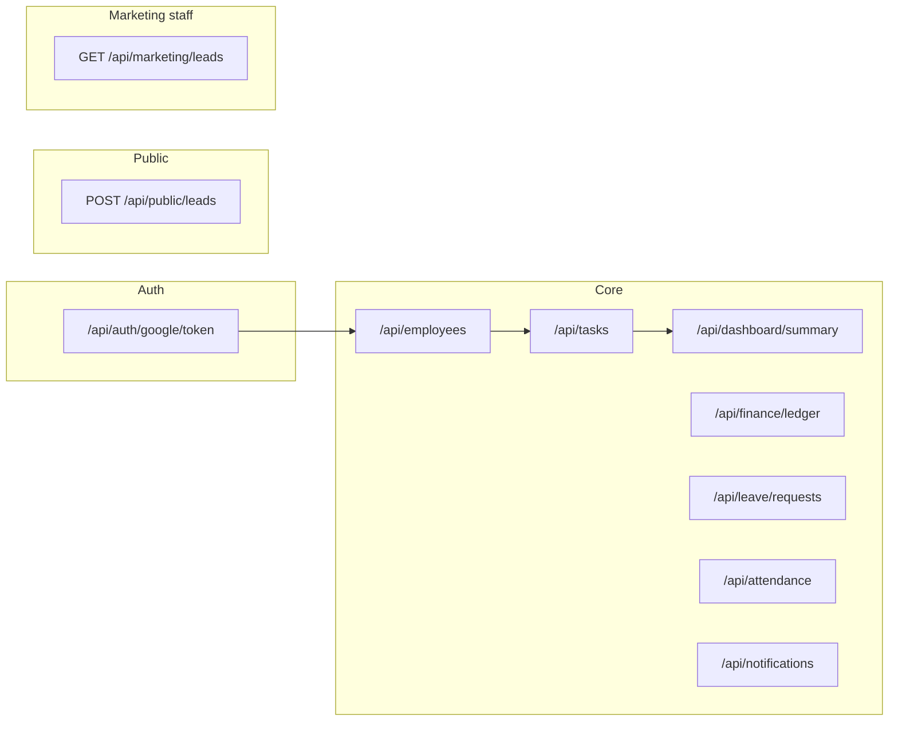

# API Contract Examples

This document lists **representative JSON payloads** for the REST API. It is **not** an OpenAPI spec; use it for integration tests, mock alignment, and partner communication. When behaviour changes, update this file and the implementation together.

## API map (logical)



**Base URL (local):** `http://localhost:4000`

## Public marketing (no auth)

Contact form submissions from the public landing page. **CORS:** the web-admin origin must be listed in `CORS_ORIGINS` on the API (comma-separated).

### POST `/api/public/leads`

Request:
```json
{
  "name": "Ravi Kumar",
  "email": "ravi@example.com",
  "subject": "RFQ — bracket batch",
  "message": "Please share capability for 500 pcs/month.",
  "pageUrl": "https://example.com/?utm_source=google",
  "referrer": "https://google.com/",
  "utmSource": "google",
  "utmMedium": "cpc",
  "utmCampaign": "spring_2026"
}
```

Response `201`:
```json
{ "ok": true }
```

Validation errors return `400` with `VALIDATION_ERROR`. Honeypot field `company` must be empty; if filled (bots), the API still returns `201` without persisting.

Too many submissions from the same IP return `429` with `RATE_LIMIT` (defaults: 5 per 15 minutes; configurable via env).

### GET `/api/marketing/leads` (ADMIN, MANAGER)

Query: `page`, `limit` (pagination).

Response:
```json
{
  "items": [
    {
      "id": "clx…",
      "name": "Ravi Kumar",
      "email": "ravi@example.com",
      "subject": "RFQ",
      "message": "…",
      "pageUrl": "https://…",
      "referrer": null,
      "utmSource": "google",
      "utmMedium": "cpc",
      "utmCampaign": null,
      "createdAt": "2026-03-31T12:00:00.000Z"
    }
  ],
  "page": 1,
  "limit": 20,
  "total": 1
}
```

## Headers

Protected endpoints use JWT:

```http
Authorization: Bearer <app-jwt-token>
Content-Type: application/json
```

---

## 1) Auth

### POST `/api/auth/google/token`

Request:
```json
{
  "idToken": "GOOGLE_ID_TOKEN_FROM_CLIENT",
  "role": "ADMIN"
}
```

Response:
```json
{
  "token": "APP_JWT_TOKEN",
  "user": {
    "id": "cm123user",
    "email": "admin@skenterprises.example",
    "fullName": "SK Admin",
    "role": "ADMIN",
    "googleId": "11445566778899",
    "isActive": true,
    "createdAt": "2026-03-30T17:20:00.000Z",
    "updatedAt": "2026-03-30T17:20:00.000Z"
  }
}
```

---

## 2) Employees

### GET `/api/employees`

Response:
```json
[
  {
    "id": "cm_emp_1",
    "email": "rahul@ak.local",
    "fullName": "Rahul Shinde",
    "role": "EMPLOYEE",
    "isActive": true,
    "employeeProfile": {
      "id": "cm_profile_1",
      "salaryBase": "22000.00",
      "leaveAllowance": 24,
      "phone": "9876543210"
    }
  }
]
```

### POST `/api/employees`

Request:
```json
{
  "email": "vikas@ak.local",
  "fullName": "Vikas Jadhav",
  "salaryBase": 24000,
  "phone": "9876501234"
}
```

Response:
```json
{
  "id": "cm_emp_2",
  "email": "vikas@ak.local",
  "fullName": "Vikas Jadhav",
  "role": "EMPLOYEE",
  "employeeProfile": {
    "id": "cm_profile_2",
    "salaryBase": "24000.00",
    "leaveAllowance": 24,
    "phone": "9876501234"
  }
}
```

---

## 3) Tasks

### GET `/api/tasks?employeeId=cm_emp_1`

Response:
```json
[
  {
    "id": "cm_task_1",
    "employeeId": "cm_emp_1",
    "assignedById": "cm_admin_1",
    "assignmentDate": "2026-03-31T00:00:00.000Z",
    "targetCount": 1000,
    "achievedCount": 350,
    "status": "IN_PROGRESS",
    "issueNotes": "Machine vibration",
    "taskTemplate": {
      "id": "cm_template_1",
      "partNumber": "PP-102",
      "partName": "Pressure Valve Plate"
    },
    "progressLogs": [
      {
        "id": "cm_log_1",
        "incrementCount": 50,
        "currentCount": 300,
        "issueNotes": "Minor vibration"
      }
    ],
    "suggestions": [
      {
        "id": "cm_sug_1",
        "comment": "Reduce spindle speed by 5%."
      }
    ]
  }
]
```

### POST `/api/tasks/assign`

Request:
```json
{
  "employeeId": "cm_emp_1",
  "assignedById": "cm_admin_1",
  "assignmentDate": "2026-03-31",
  "targetCount": 1000,
  "partNumber": "PP-102",
  "partName": "Pressure Valve Plate"
}
```

Response:
```json
{
  "id": "cm_task_2",
  "employeeId": "cm_emp_1",
  "assignedById": "cm_admin_1",
  "assignmentDate": "2026-03-31T00:00:00.000Z",
  "targetCount": 1000,
  "achievedCount": 0,
  "status": "PENDING",
  "taskTemplate": {
    "id": "cm_template_2",
    "partNumber": "PP-102",
    "partName": "Pressure Valve Plate"
  }
}
```

### POST `/api/tasks/:id/progress`

Request:
```json
{
  "employeeId": "cm_emp_1",
  "incrementCount": 50,
  "issueNotes": "Material delay for 20 mins"
}
```

Response:
```json
{
  "id": "cm_task_2",
  "targetCount": 1000,
  "achievedCount": 50,
  "status": "IN_PROGRESS",
  "issueNotes": "Material delay for 20 mins"
}
```

### POST `/api/tasks/:id/suggestions`

Request:
```json
{
  "suggestedById": "cm_manager_1",
  "comment": "Use backup fixture during material waiting period."
}
```

Response:
```json
{
  "id": "cm_sug_2",
  "taskAssignmentId": "cm_task_2",
  "suggestedById": "cm_manager_1",
  "comment": "Use backup fixture during material waiting period.",
  "createdAt": "2026-03-30T18:01:00.000Z"
}
```

---

## 4) Dashboard

### GET `/api/dashboard/summary`

Response:
```json
{
  "day": {
    "achieved": 320,
    "target": 1000
  },
  "week": {
    "achieved": 2200,
    "target": 5000
  }
}
```

---

## 5) Finance

### GET `/api/finance/ledger/cm_emp_1`

Response:
```json
[
  {
    "id": "cm_led_1",
    "employeeId": "cm_emp_1",
    "entryType": "ADVANCE",
    "amount": "3000.00",
    "note": "Family emergency",
    "entryDate": "2026-03-15T00:00:00.000Z"
  },
  {
    "id": "cm_led_2",
    "employeeId": "cm_emp_1",
    "entryType": "SALARY_CREDIT",
    "amount": "22000.00",
    "note": "March salary",
    "entryDate": "2026-03-30T00:00:00.000Z"
  }
]
```

### POST `/api/finance/ledger`

Request:
```json
{
  "employeeId": "cm_emp_1",
  "entryType": "ADVANCE",
  "amount": 2000,
  "note": "Advance for travel"
}
```

Response:
```json
{
  "id": "cm_led_3",
  "employeeId": "cm_emp_1",
  "entryType": "ADVANCE",
  "amount": "2000.00",
  "note": "Advance for travel",
  "entryDate": "2026-03-30T18:08:00.000Z"
}
```

---

## 6) Leave

### GET `/api/leave/requests/cm_emp_1`

Response:
```json
[
  {
    "id": "cm_leave_1",
    "employeeId": "cm_emp_1",
    "fromDate": "2026-04-03T00:00:00.000Z",
    "toDate": "2026-04-04T00:00:00.000Z",
    "totalDays": 2,
    "reason": "Personal work",
    "status": "PENDING"
  }
]
```

### POST `/api/leave/requests`

Request:
```json
{
  "employeeId": "cm_emp_1",
  "fromDate": "2026-04-10",
  "toDate": "2026-04-12",
  "totalDays": 3,
  "reason": "Family function"
}
```

Response:
```json
{
  "id": "cm_leave_2",
  "employeeId": "cm_emp_1",
  "fromDate": "2026-04-10T00:00:00.000Z",
  "toDate": "2026-04-12T00:00:00.000Z",
  "totalDays": 3,
  "reason": "Family function",
  "status": "PENDING"
}
```

---

## 7) Attendance

Dates are normalized to **UTC midnight** per calendar day. At most one row per `(employeeProfileId, attendanceDate)`.

### GET `/api/attendance/me-profile`

Response:
```json
{
  "employeeProfileId": "cm_profile_1"
}
```

(`null` when the user has no linked `EmployeeProfile`, e.g. some ADMIN users.)

### GET `/api/attendance?fromDate=2026-03-01&toDate=2026-03-31&page=1&limit=20`

Optional query: `employeeProfileId` (ADMIN/MANAGER only).

Response:
```json
{
  "items": [
    {
      "id": "cm_att_1",
      "employeeProfileId": "cm_profile_1",
      "attendanceDate": "2026-03-30T00:00:00.000Z",
      "isPresent": true,
      "notes": null,
      "createdAt": "2026-03-30T08:00:00.000Z",
      "employeeProfile": {
        "id": "cm_profile_1",
        "user": {
          "id": "cm_emp_1",
          "fullName": "Rahul Shinde",
          "email": "rahul@ak.local"
        }
      }
    }
  ],
  "page": 1,
  "limit": 20,
  "total": 1
}
```

### POST `/api/attendance`

Request (upsert by profile + day):
```json
{
  "employeeProfileId": "cm_profile_1",
  "attendanceDate": "2026-03-30",
  "isPresent": true,
  "notes": "Half day — doctor"
}
```

Response: single attendance row with `employeeProfile` include (same shape as list item).

---

## Notifications

Protected with JWT. Workshop location is readable by all authenticated roles. Dispatch and daily-summary are **ADMIN/MANAGER**.

### GET `/api/notifications/workshop-location`

Response:
```json
{
  "name": "SK Enterprises",
  "latitude": 18.6298,
  "longitude": 73.8478,
  "mapUrl": "https://www.google.com/maps?q=18.6298,73.8478"
}
```

### POST `/api/notifications/dispatch`

Request:
```json
{
  "event": "TASK_ASSIGNED",
  "channels": ["email", "sms"],
  "recipients": {
    "emails": ["employee@example.com"],
    "phoneNumbers": ["919876543210"]
  },
  "subject": "New task",
  "message": "You were assigned a new task."
}
```

Response `202`:
```json
{
  "status": "accepted",
  "event": "TASK_ASSIGNED",
  "result": {
    "provider": "none",
    "email": { "attempted": true, "sent": false, "reason": "Email provider not configured yet" },
    "sms": { "attempted": true, "sent": false, "reason": "SMS provider not configured yet" }
  }
}
```

### POST `/api/notifications/daily-summary`

Request (optional date `YYYY-MM-DD`; defaults to today):
```json
{
  "date": "2026-03-31"
}
```

Response `202`:
```json
{
  "status": "accepted",
  "date": "2026-03-31"
}
```

**Side effects:** Successful task assignment, leave approval/rejection, and new ledger entries **queue** the same notification pipeline (fire-and-forget). Actual SMS/email delivery requires provider configuration and env flags (`EMAIL_NOTIFICATIONS_ENABLED`, `SMS_NOTIFICATIONS_ENABLED`, `NOTIFICATION_PROVIDER`).

---

## Standard Error Shape (recommended)

```json
{
  "message": "Validation failed",
  "code": "VALIDATION_ERROR",
  "details": [
    {
      "field": "targetCount",
      "issue": "Must be greater than 0"
    }
  ]
}
```
