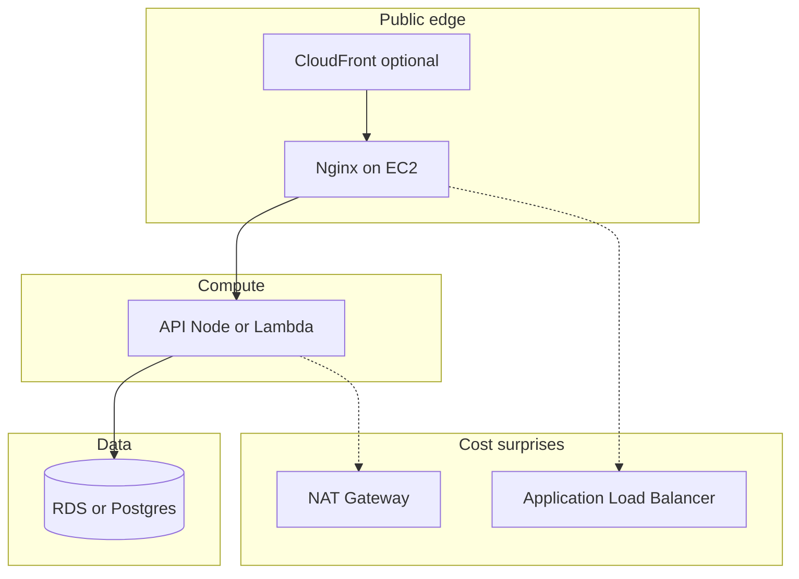

# AWS Infrastructure — Monthly Cost Guide (SK Enterprises)

This document estimates **ongoing monthly AWS spend** for the SK Enterprises stack: API (Express), PostgreSQL, static web admin, TLS, and typical supporting services. Figures are **order-of-magnitude USD** for **ap-south-1 (Mumbai)**. Actual bills depend on instance sizes, traffic, backups, and HA choices — validate with the [AWS Pricing Calculator](https://calculator.aws/).

**FX (indicative):** multiply USD by roughly **₹83–85** for INR planning (rates move; AWS often bills in USD).

---

## Reference topology (cost drivers)

**NAT Gateway** and **ALB** are optional but often dominate small bills; see sections below.

---

## What we are costing

| Layer | Typical AWS mapping |
|--------|----------------------|
| API | EC2 (Docker/Node) or Lambda + API Gateway |
| Database | RDS PostgreSQL or PostgreSQL on same EC2 (lean) |
| Web admin (static) | S3 + CloudFront, or served from EC2 + Nginx |
| TLS | ACM (certs) — no extra charge for ACM itself; ALB/CloudFront may apply |
| Secrets | Secrets Manager or SSM Parameter Store (cheaper) |

---

## Option A — Lean (single EC2)

**Profile:** Early production or low traffic; few concurrent users; mostly internal workshop use.

| Item | Notes | ~Monthly (USD) |
|------|--------|-----------------|
| **EC2** | e.g. `t3.small` / `t3.medium` — API + Nginx + optional Postgres in Docker | **$15–45** |
| **EBS** | 30–80 GB gp3 | **$3–10** |
| **Elastic IP** | One static IP if needed | **~$0–4** (often free when attached to running instance) |
| **Backups** | EBS snapshots, light | **$2–8** |
| **Data transfer** | Low outbound | **$0–15** |

**Rough total:** **~$25–80 / month**

---

## Option B — Small production (RDS + app host + static web)

**Profile:** Managed Postgres separate from app; static frontend on object storage + CDN.

| Item | Notes | ~Monthly (USD) |
|------|--------|-----------------|
| **RDS PostgreSQL** | e.g. `db.t3.micro` / `db.t4g.micro`, single-AZ, ~20 GB | **$15–40** |
| **EC2** | `t3.small` for API + Nginx | **$15–35** |
| **ALB** | Optional; if you terminate TLS here or need LB | **~$18–25** + LCU usage |
| **S3 + CloudFront** | Static web admin assets | **$1–15** |
| **Secrets Manager** | Few secrets | **$1–5** |
| **NAT Gateway** | **If** API/tasks in private subnets need outbound via NAT | **~$32+** per NAT/month + data (often the largest surprise) |

**Rough total without NAT:** **~$50–120 / month**  
**With NAT in a typical “private VPC” setup:** often **~$90–200+ / month** unless NAT is minimized (single AZ, VPC endpoints, or different topology).

---

## Option C — Full API on Lambda (Lambda + API Gateway)

**Profile:** Express/API deployed as Lambda behind API Gateway; **no EC2 for the app**. Database still **RDS** (or Aurora Serverless v2) — Prisma connects over the network.

### What drives Lambda cost

| Component | Billing model (short) |
|-----------|------------------------|
| **Lambda** | Per **request** + per **GB-second** (memory × duration). Cold starts do not add a separate line item; they add duration. |
| **API Gateway** | **HTTP API** is cheaper than **REST API** for typical JSON APIs. Per million requests + optional data transfer. |
| **VPC** | If Lambda is **inside a VPC** to reach RDS in a private subnet, you often need **NAT Gateway** for outbound (e.g. Google token verification) unless you use **VPC endpoints** — NAT can dominate cost (~**$32+/month** per NAT). |

### Rough monthly ranges (SK-sized workshop traffic)

Assume **ap-south-1**, **HTTP API**, Lambda **512 MB**, average **150–300 ms** per request, **RDS db.t3.micro** single-AZ.

| Traffic level | Invocations / month | Lambda + HTTP API (order of magnitude) | RDS | **Subtotal (no NAT)** |
|---------------|----------------------|----------------------------------------|-----|------------------------|
| Very light (internal, &lt; 20 users) | ~0.5–2 M | **~$3–15** | **~$15–35** | **~$20–55** |
| Light | ~2–10 M | **~$10–40** | **~$15–40** | **~$30–85** |
| Moderate | ~10–50 M | **~$40–120+** | **~$25–60** | **~$70–180+** |

Add **~$32+ / month per NAT Gateway** if Lambda sits in a private subnet and needs internet without endpoints.

Add **S3 + CloudFront** for web admin (**~$1–15**), **CloudWatch** logs (**~$1–10** at low volume), **Secrets Manager** (**~$1–5**).

**Typical “Lambda API + RDS + static web + no NAT” total:** **~$25–80 / month**  
**Same + one NAT:** often **~$60–120+ / month** (NAT + RDS + Lambda).

---

## Option D — Hybrid (“only a few things” on Lambda)

**Profile:** Keep **EC2** (or single box) for most of the app, move **some** workloads to Lambda.

Examples:

| Pattern | Extra cost |
|---------|------------|
| **Scheduled jobs** (reports, reminders) — a few runs/day | **~$0–2 / month** (Lambda is often free tier or cents) |
| **Async heavy** (image processing, CSV export) — low volume | **~$1–10 / month** |
| **Auth hook** or **webhook** only on Lambda; main API on EC2 | **~$2–15 / month** for low request |

**Rule of thumb:** partial Lambda adds **~$0–25 / month** on top of your EC2/RDS baseline unless you move **most** API traffic to Lambda (then use Option C math).

---

## Compare: EC2 API vs Lambda API (same RDS)

| | **EC2 for API** | **Lambda for API** |
|--|-----------------|----------------------|
| **Baseline** | Fixed EC2 hours even if idle | **~$0** at zero traffic; pay per use |
| **Low traffic** | **~$15–45** EC2 | Often **~$3–20** for Lambda + HTTP API |
| **High traffic** | Scale = bigger instance or ASG | Can grow with requests; watch API Gateway + Lambda GB-s |
| **RDS** | Same | Same (**~$15–40**) |
| **VPC + NAT** | Optional if DB private | Lambda in VPC often needs NAT or endpoints |

For many **small internal workshops**, **Lambda + HTTP API + RDS** can land in **~$25–80 / month** **without NAT**; **with NAT**, add **~$32+** unless you redesign networking.

---

## Cost traps to avoid

1. **NAT Gateway** — Often **~$32+/month per NAT** in a region; multi-AZ NAT multiplies. Plan VPC so small shops do not pay NAT for nothing.
2. **RDS** — Multi-AZ and larger instance classes increase cost quickly; start **single-AZ** for non-critical internal tools if downtime risk is acceptable.
3. **Application Load Balancer** — Skip until you need HA or a hard requirement for ALB features; it has a fixed monthly component plus LCU charges.
4. **Egress** — CloudFront can reduce origin egress; still monitor outbound data from EC2/RDS.

---

## One-line summary

| Scenario | ~Monthly (USD) |
|----------|----------------|
| Cheapest realistic AWS footprint (single EC2 style) | **$25–80** |
| Cleaner prod (RDS + app + static web), no NAT surprise | **$50–150** |
| **Full API on Lambda** + RDS + static web, **no NAT** | **~$25–80** |
| **Full API on Lambda** + RDS + **one NAT** (VPC) | **~$60–120+** |
| Hybrid: EC2 + “a few” Lambda functions | **EC2/RDS baseline + ~$0–25** |
| Same + NAT/ALB/HA patterns | **$90–250+** |

---

## Next steps for a fixed quote

1. Fix **region** (e.g. `ap-south-1`).
2. Choose **RDS vs Postgres on EC2** and **instance size**.
3. Decide **NAT** (yes/no) and **ALB** (yes/no).
4. Estimate **daily active users** and **API requests/day**.
5. Run **AWS Pricing Calculator** and add **10–20% buffer** for transfer and growth.

---

## Related docs

- [07-MONOREPO-AND-DEPLOYMENT.md](./07-MONOREPO-AND-DEPLOYMENT.md) — deployment layout
- [08-TECH-DECISIONS.md](./08-TECH-DECISIONS.md) — stack choices
