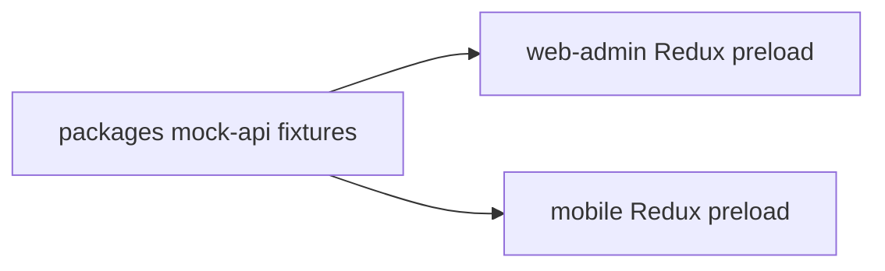
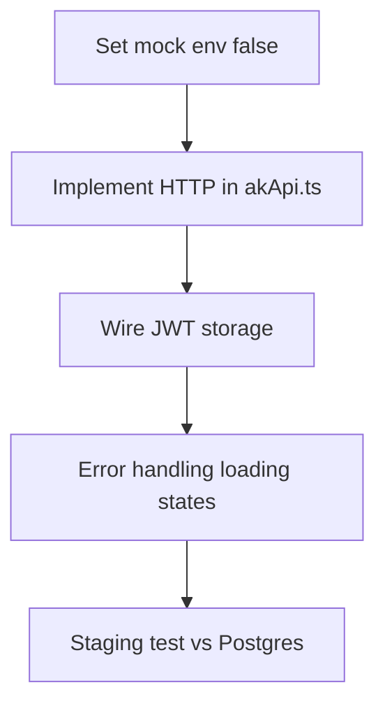

# Mock prototype workflow

SK Enterprises development intentionally supports a **mock-first** path: **web** and **mobile** can reach **production UI quality** while **PostgreSQL** and live HTTP integration are optional. This reduces risk for workshops that want to **see and feel** the product before committing infra.

---

## 1. Why mocks exist

| Goal | How mocks help |
|------|----------------|
| **Parallel work** | UI/UX and API schema evolve without blocking each other |
| **Demos** | Predictable data for stakeholders |
| **Tests** | Stable fixtures for unit/integration tests later |

---

## 2. Data flow (mock mode)

**No network** is required for the mock path in the default configuration.

---

## 3. Shared package

| Package | Responsibility |
|---------|------------------|
| `@sk/mock-api` | `getWebAdminMockBootstrap()`, `getMobileMockBootstrap()`, `mockDelay()`, raw fixtures |

Edit **`packages/mock-api/src/fixtures/*.ts`** to change demo content once for **both** clients.

---

## 4. App toggles

| App | Env variable | Behaviour |
|-----|--------------|-----------|
| Web | `VITE_USE_MOCK_API` | When **not** `false`, Redux uses `webPreload` from mocks |
| Mobile | `EXPO_PUBLIC_USE_MOCK_API` | When **not** `false`, store `preloadedState` from mocks |

**Defaults:** mock mode is **on** unless explicitly disabled (see app `mocks/config.ts` files).

---

## 5. Live API cutover (checklist)

1. Set `VITE_USE_MOCK_API=false` / `EXPO_PUBLIC_USE_MOCK_API=false`.
2. Point `VITE_API_BASE_URL` (web) to staging API.
3. Implement `fetchBootstrap` and per-resource calls in:
   - `apps/web-admin/src/services/akApi.ts`
   - `apps/mobile/services/akApi.ts`
4. Keep `@sk/mock-api` for Storybook/tests; optionally add **MSW** for CI.

---

## 6. Alignment with API docs

Fixture shapes should stay aligned with [10-API-CONTRACT-EXAMPLES.md](./10-API-CONTRACT-EXAMPLES.md). When API changes, update:

- `packages/mock-api`
- `docs/10-API-CONTRACT-EXAMPLES.md`

---

## 7. Related documents

- Repo overview: [09-REPO-STRUCTURE.md](./09-REPO-STRUCTURE.md)
- Deployment: [07-MONOREPO-AND-DEPLOYMENT.md](./07-MONOREPO-AND-DEPLOYMENT.md)
